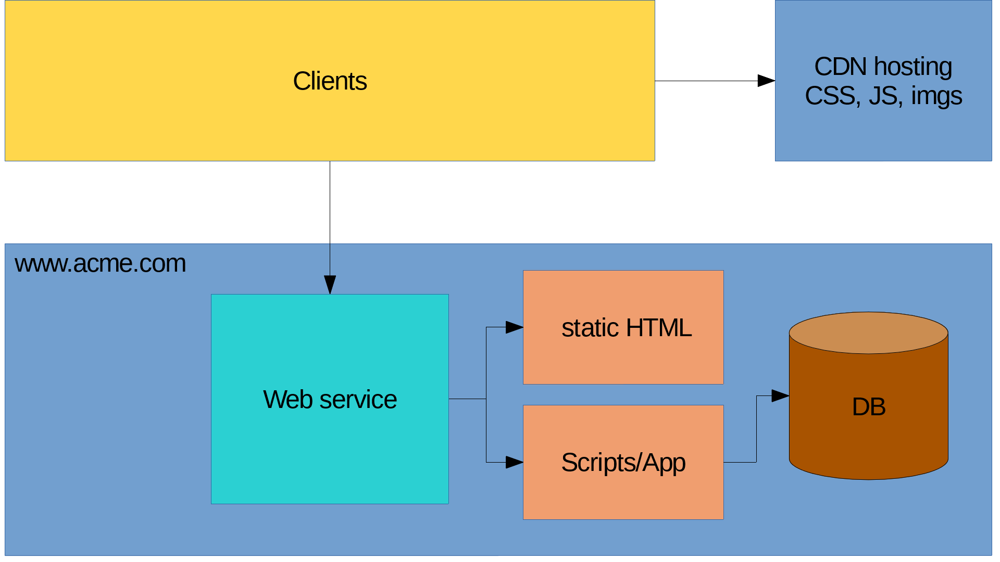
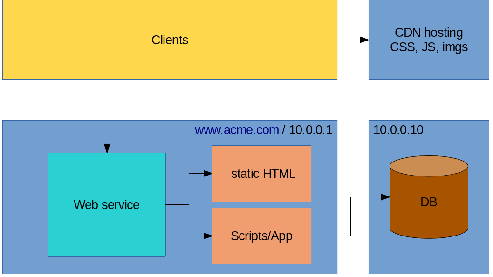
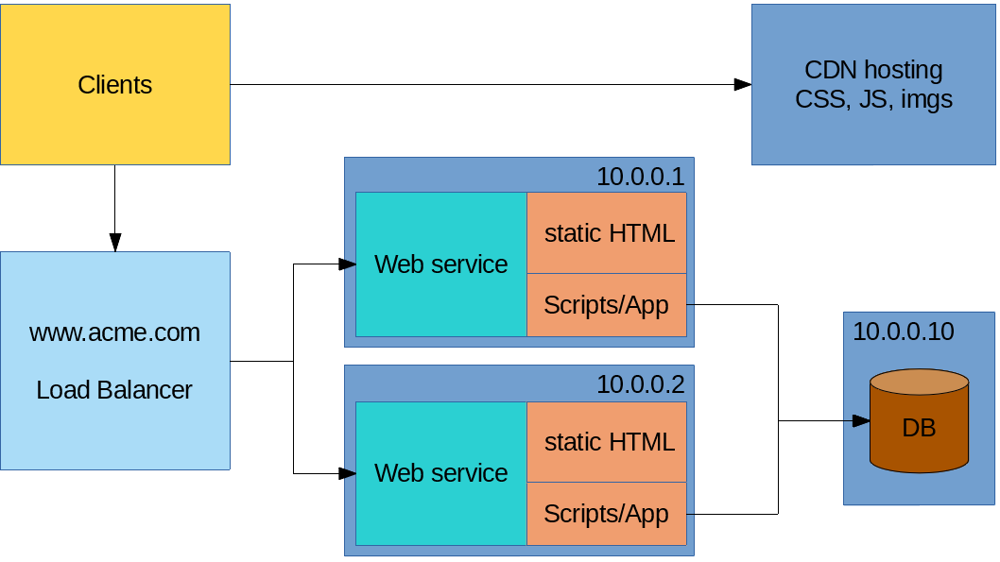
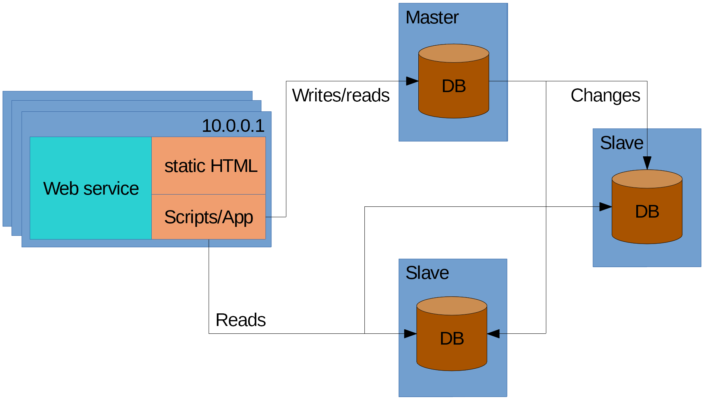
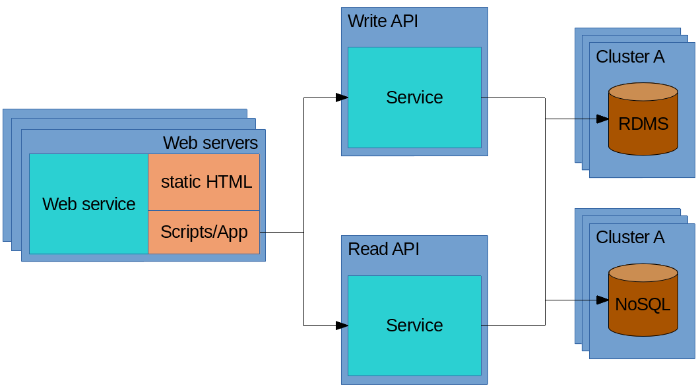
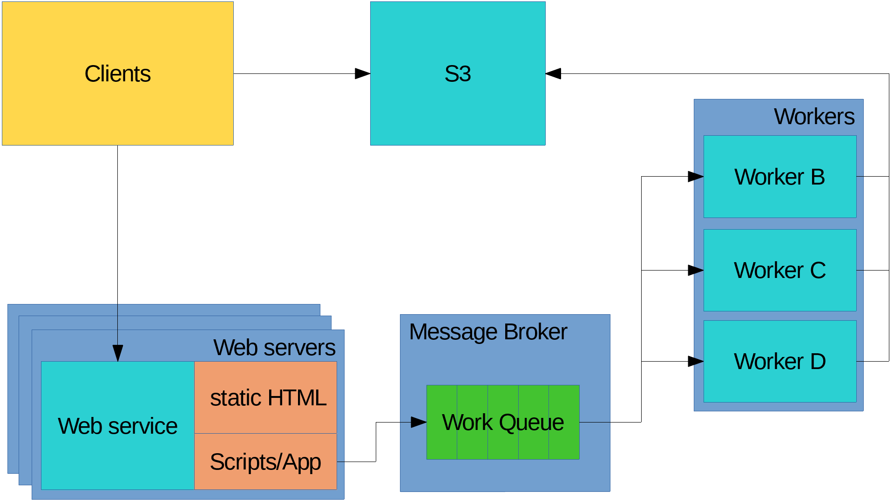

# Modern Web Services
## How we serve up our content

---

# About me

## Ryan Olds

* Software engineer / Full-stack developer
* ryanrolds@gmail.com
* https://github.com/ryanrolds
* Works at IRIS Educational Media (until mid-June)

---

# Transparancy

* This talk was going to be 2 hours
* And about much more boring stuff

---

# Questions? Comments?

Raise you hand. 

---

# Overview

* Software commonly found in web services
* We are going to use a broad definition of content
* If we move too quick raise your hand tell me to slow down

---

# Single web server

---

# And this work, but...

* What happens when we have a 100/1k/10k active users
* Other business units start wanting reports, notifications, etc...
* Monitoring

---

# Common problems

* Too much load (CPU)
* Not enough memory (RAM)
* Input/Output and disk space
* Network speed and latency
* Computers/applications crash - fault tolerance

---

# What can we do?

* Improve the performance of our code
* Scale vertically (larger server)
* Scale horizontally (more servers)

--- 

# CDN

---

# DB on it's own server

---

# Load balancers

---

# Scaling the data(base|stores)

---

# Read/write API

---

## Background process & reporting

Sometimes what the user wants to do is just too resource intensive to handle with HTTP.

* Report generation
* Importing/exporting data
* Other resource intensive tasks

---

# Message Brokers/Queues

---

# What next?

Look for libraries/modules for interacting with these various services and try them.

Lots of great information here: https://github.com/donnemartin/system-design-primer

---

# Questions?

---

# Thanks

Make sure to come to the next one. 

